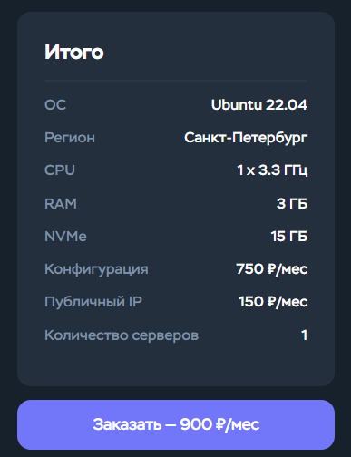

# Проект базы данных

## Общая структура проекта:
1. Создание базы данных `Postgre` с использованием `DjORM` моделей.
2. Интеграция с `API` систем `Hollihop` и `amoCRM`.
3. Разработка моделей для сущностей `CRM` систем.
4. Синхронизация `CRM` система и нашей `DB`

# Примерная оценка основных этапов по времени

## 1. Построение взаимодействия системы: 20 часов

## 2. Разработка моделей базы данных и интеграции для Hollihop
- **Локации (GetLocations)**: 30 мин
- **Филиалы (GetOffices)**: 30 мин
- **Заявки на обучение (GetStudyRequests)**: 2 часа
- **Лиды (GetLeads, GetLeadStatuses, GetHistoryModifyLeadStatus)**: 4 часа
- **Клиенты (GetStudents, GetCompanies, GetClientStatuses, GetClientFiles, GetStudentPersonalOfficeSettings)**: 5 часов
- **Сотрудники (GetEmployees, GetTeachers, GetEmployeeStatuses)**: 6 часов
- **Учебные единицы (GetEdUnits, GetEdUnitStudents, GetEdUnitLeads, GetLessonPlans)**: 4 часа
- **Параметры обучения (GetDisciplines, GetLevels, GetLearningTypes)**: 30 мин
- **Финансы (GetPrices, GetDiscounts, GetSurcharges, GetPayments, GetBalances, GetIncomesAndOutgoes)**: 4 часа
- **Разное (GetSupplies, GetEdMaterials, GetAnnouncements)**: 30 мин

* ### **Итого**: 27 часов

## 3. Разработка моделей и интеграция для amoCRM
- **Пользователи (Users)**: 2 часа
- **Сделка (Deals)**: 5 часов
- **Неразобранное (Unsorted)**: 1 час
- **Воронки и этапы (Pipelines and Stages)**: 5 часов
- **Контакты (Contacts)**: 2 часа
- **Компании (Companies)**: 2 часа
- **Списки (Catalogs)**: 1 час
- **Связи сущностей (Entity Links)**: 2 часа
- **Задачи (Tasks)**: 4 часа
- **Поля и группы полей (Fields and Field Groups)**: 4 часа
- **Теги (Tags)**: 1 час
- **События и примечания (Events and Notes)**: 2 часа
- **Покупатели (Customers)**: 4 часа
- **Статусы и сегменты покупателей (Customer Statuses and Segments)**: 3 часа
- **Беседы (Chats)**: 3 часа

* ### **Итого**: 42 часа

## 4. Обеспечение синхронизации DB с CRM
  - **Создание системы для приема и парсинга хуков от `Amo`**: 10 часов
  - **Создание функционала для ночной выгрузки данных по `Hollihop`**: 5 часов
  - **Настройка `Celery` и `RabbitMQ` для очередей задач**: 9 часов
  - **Организация генерации очереди задач на основе хуков и последовательного их исполнения**: 6 часов

* ### **Итого**: 30 часов

## Цены серверов

* ### Сервер для парсинга базы данных и синхронизации
  - **Стоимость сервера**: 900 руб/мес = 10,800 руб/год
  - **SSL сертификат**: 2,500 руб/год
  - **Домен**: В зависимости от зоны (например, .com ≈ 500 руб/год)
  
  * **Итого**: 13,800 руб/год (примерная стоимость)

* ### Сервер для базы данных PostgreSQL
  - **Стоимость сервера**: 380 руб/мес = 4,560 руб/год
  - **SSL сертификат**: 2,500 руб/год
  
  * **Итого**: 7,060 руб/год (примерная стоимость)

# Итоговая оценка разработки проекта
Средне-рыночная ставка разработчика `Middle+`/`Senior` разработчика составляет 20 USD/час.
- **Построение взаимодействия всей системы**: 20 часов
- **Установка и настройка серверов**: 3 часа
- **Разработка моделей и интеграция для Hollihop**: 27 часов
- **Разработка моделей и интеграция для amoCRM**: 42 часов
- **Обеспечение синхронизации DB с CRM**: 30 часов

* ### **Общее время**: 122 часа
* ### **Общая стоимость**: 122 часа * 20 USD/час = 2,440 USD
* ### **Цена за сервера**: ~ 20,860 руб/год

# Скриншоты цен на сервера
* ## Main Analytic Server
  

* ## Postgre Server
  